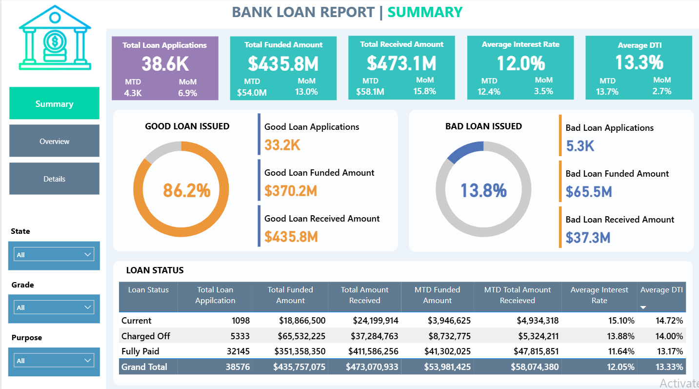
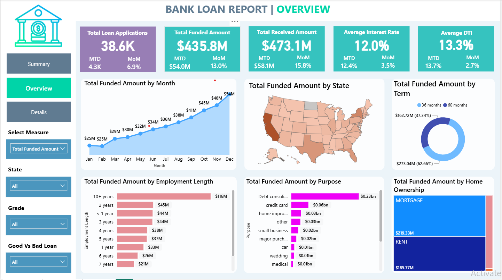
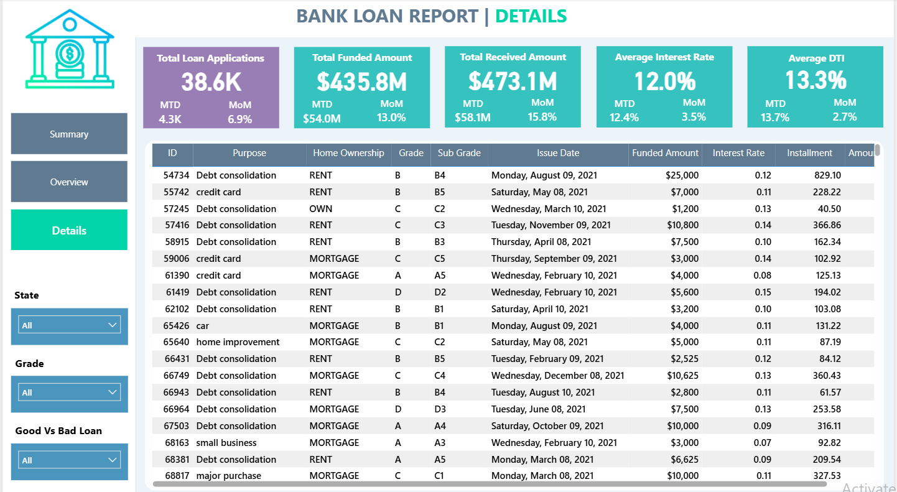

# Bank Loan Analysis (SQL + Power BI + Excel)

This project focuses on analyzing bank loan data to identify key trends, assess lending performance, and evaluate risk patterns. Using SQL for data processing and Power BI for visualization, the project highlights insights that support data-driven lending decisions.

## Table of Contents
1. [Project Overview](#project-overview)  
2. [Objective](#objective)  
3. [Dataset Description](#dataset-description)  
4. [Tools & Technologies Used](#tools--technologies-used)  
5. [Key Performance Indicators (KPIs)](#key-performance-indicators-kpis)  
6. [Dashboards](#dashboards)  
   - [Summary Dashboard](#summary-dashboard)  
   - [Overview Dashboard](#overview-dashboard)  
   - [Details Dashboard](#details-dashboard)  
7. [Implementation](#implementation)  
8. [Data Validation](#data-validation)  
9. [Insights & Observations](#insights--observations)  
10. [Conclusion](#conclusion)  
11. [Author](#author)

## Project Overview
The goal of this project is to perform an end-to-end analysis of loan data from a financial institution. The analysis covers loan disbursement trends, borrower profiles, interest rates, and repayment performance. Results are visualized in Power BI to provide actionable insights for risk assessment and business decision-making.

## Objective
- To analyze overall loan performance and borrower behavior.
- To classify loans into 'Good' and 'Bad' categories based on repayment.
- To study relationships between interest rate, loan amount, and income.
- To visualize insights that help stakeholders improve lending strategies.

## Dataset Description
- **Source:** Open-source bank loan dataset (approx. 38,000 records, 24–25 columns)
- **Key Columns:** loan_id, purpose, funded_amount, interest_rate, dti, annual_income, loan_status, issue_date
- **Cleaning & Processing:** Missing value handling, date extraction, data type conversions

## Tools & Technologies Used
- **SQL:** Data cleaning, transformation, and aggregation
- **Power BI:** Interactive dashboards and KPIs
- **Excel:** Exploratory analysis and data validation

## Key Performance Indicators (KPIs)
- Total Loan Applications
- Total Funded Amount
- Total Amount Received
- Average Interest Rate
- Average Debt-to-Income Ratio (DTI)
- % of Good Loans vs. Bad Loans

## 📊 Dashboards Overview

The project includes three interactive Power BI dashboards — **Summary**, **Overview**, and **Details** — designed to analyze and visualize loan performance and borrower data effectively.

---

### 🧮 Summary Dashboard

The **Summary Dashboard** captures key loan-related metrics and their changes over time, providing a snapshot of the loan portfolio's overall health and lending strategy impact.  
It includes the following KPIs:
- **Total Loan Applications (MTD and MoM)**
- **Total Funded Amount (MTD and MoM)**
- **Total Amount Received (MTD and MoM)**
- **Average Interest Rate (MTD and MoM)**
- **Average Debt-to-Income Ratio (DTI) (MTD and MoM)**  
Additionally, it distinguishes between *Good Loans* and *Bad Loans*, with specific indicators for each category — helping assess loan portfolio quality.

---

### 🌐 Overview Dashboard

The **Overview Dashboard** visually represents various loan-related metrics through multiple chart types:
- **Monthly Trends by Issue Date**
- **Regional Analysis by State**
- **Loan Term Analysis**
- **Employment Length Analysis**
- **Loan Purpose Breakdown**
- **Home Ownership Analysis**  
These visualizations help identify trends, seasonal patterns, and the distribution of loans across multiple borrower and loan characteristics.

---

### 🗂️ Details Dashboard

The **Details Dashboard** provides a granular, user-friendly view of all loan data for in-depth analysis of borrower profiles and performance metrics.  
Key data fields include:
- Loan ID, Address State, Employment Length, Employee Title  
- Grade/Sub Grade, Home Ownership, Issue Date, Loan Status  
- Purpose, Term, Verification Status, Annual Income  
- DTI, Instalment, Interest Rate, and Loan Amount  

Each field plays a critical role in loan management, risk assessment, and data-driven decision-making.

## Implementation
The project involved importing the dataset from Excel into MySQL for cleaning, analysis, and visualization using Power BI. The dashboards were designed to meet the specified business requirements and aligned with the data dictionary to ensure correct field usage and interpretation. Each visualization was carefully structured to reflect key business KPIs, allowing decision-makers to evaluate loan performance, customer risk, and portfolio trends effectively.

## Data Validation
A thorough data validation process was carried out to ensure the dashboards accurately represented the underlying data:

- **SQL Query Verification:** Executed raw SQL queries on the database to cross-check aggregated metrics with those displayed in Power BI.  
- **Data Consistency Checks:** Compared Power BI visual outputs with SQL results to confirm data accuracy post-transformation.  
- **KPI Logic Validation:** Independently replicated KPI calculations in SQL to verify Power BI measures and DAX logic.  
- **Cross-Verification with Source Data:** Ensured all filters, aggregations, and transformations in Power BI matched the original dataset.

This multi-step validation approach ensured reliable, data-driven insights.

## Insights & Observations
- Good loans constituted a major portion of the funded amount, reflecting strong borrower credit quality.  
- Higher interest rates were associated with borrowers having lower income and longer loan terms.  
- California and Texas accounted for the highest number of loan applications, suggesting regional concentration.  
- Debt-to-Income (DTI) ratio emerged as a key indicator influencing loan defaults.  
- Short-term loans demonstrated higher repayment rates and lower default probabilities.

## Conclusion
The project successfully transformed raw loan data into actionable insights through structured SQL analysis and dynamic Power BI dashboards. By validating metrics and focusing on critical KPIs, the analysis supports better lending decisions, risk evaluation, and business performance tracking.

## Author
**Sanskar Tripathi**  
📧 Email: [sanskar.trip.ai@gmail.com](mailto:sanskar.trip.ai@gmail.com)  
💼 GitHub: [https://github.com/Sanskar-Trip-AI](https://github.com/Sanskar-Trip-AI)  
🔗 LinkedIn: [linkedin.com/in/sanskartripathi](https://www.linkedin.com/in/sanskartripathi)
